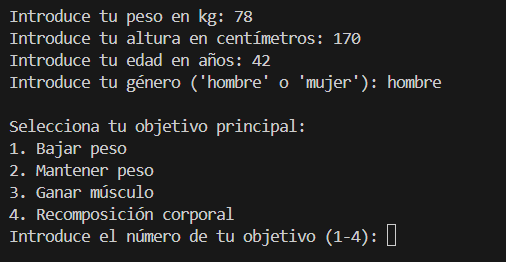
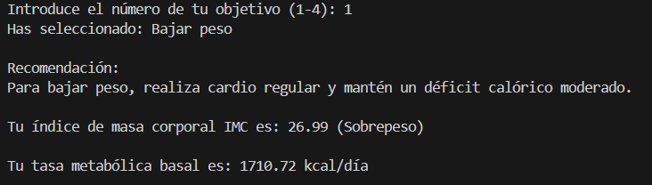
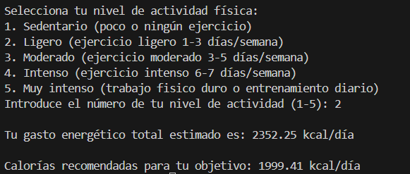

# Calculadora de Salud y Rutina

## Descripción
Esta aplicación en Python calcula indicadores de salud importantes como el Índice de Masa Corporal (IMC), la Tasa Metabólica Basal (TMB) y el Gasto Energético Total (GET). Además, ofrece recomendaciones personalizadas según el nivel de actividad física y el objetivo del usuario (bajar peso, mantener peso, ganar músculo, etc.).

El programa incluye validaciones de entrada para asegurar que el usuario introduzca datos correctos y maneja errores de forma amigable.

## Características
- Cálculo del IMC con interpretación según rangos estándar.
- Cálculo de la Tasa Metabólica Basal basada en fórmula de Harris-Benedict, considerando sexo, peso, altura y edad.
- Cálculo del Gasto Energético Total ajustado por nivel de actividad física.
- Recomendaciones nutricionales personalizadas según el objetivo del usuario.
- Validación robusta de entradas para evitar errores de usuario.

## Capturas de la interfaz




## Cómo usar
1. Ejecuta el archivo con Python 3:
```bash
python calculadora_salud.py
```
2. Sigue las instrucciones en pantalla para introducir tus datos.
3. Recibe tus resultados y recomendaciones personalizadas.

## Licencia
Este proyecto está bajo la licencia MIT. Consulta el archivo [LICENSE](LICENSE) para más detalles.

## Autor
Josu Ramos
